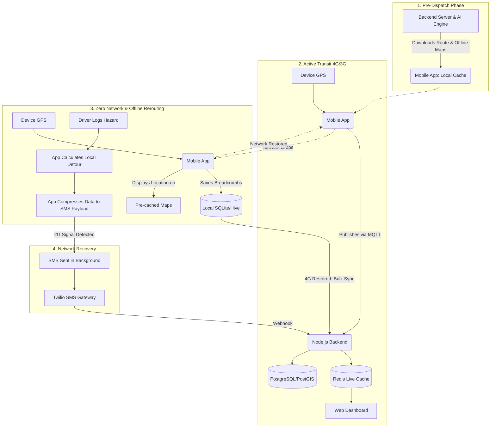

```mermaid
graph TD
    %% Pre-Dispatch Phase
    subgraph Pre-Dispatch [1. Pre-Dispatch Phase]
        A[Backend Server & AI Engine] -->|Downloads Route & Offline Maps| B(Mobile App: Local Cache)
    end

    %% Active Transit Phase
    subgraph Active_Transit [2. Active Transit 4G/3G]
        C[Device GPS] --> D(Mobile App)
        D -->|Publishes via MQTT| E(Node.js Backend)
        E --> F[(Redis Live Cache)]
        E --> G[(PostgreSQL/PostGIS)]
        F --> H[Web Dashboard]
    end

    %% Zero Network Phase
    subgraph Dead_Zone [3. Zero Network & Offline Rerouting]
        I[Device GPS] --> J(Mobile App)
        J -->|Saves Breadcrumbs| K[(Local SQLite/Hive)]
        J -->|Displays Location on| L[Pre-cached Maps]
        M[Driver Logs Hazard] --> N[App Calculates Local Detour]
        N --> O[App Compresses Data to SMS Payload]
    end

    %% Recovery Phase
    subgraph Recovery [4. Network Recovery]
        O -->|2G Signal Detected| P[SMS Sent in Background]
        P --> Q[Twilio SMS Gateway]
        Q -->|Webhook| E
        K -->|4G Restored: Bulk Sync| E
    end

    %% Flow connections between subgraphs
    B -.-> D
    D -.->|Network Drops| J
    J -.->|Network Restored| D
```

